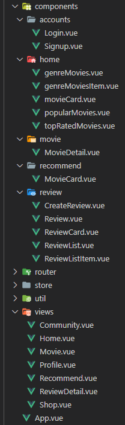
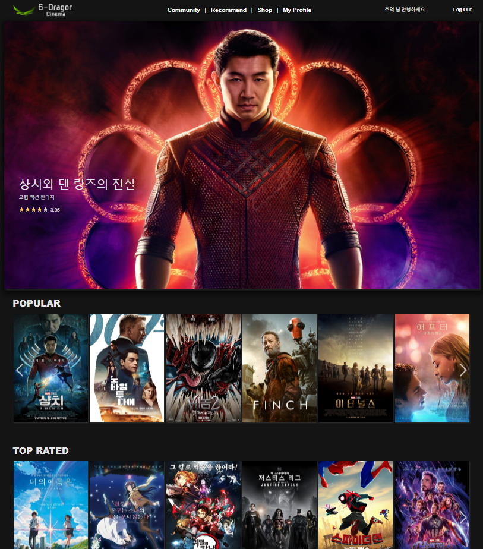
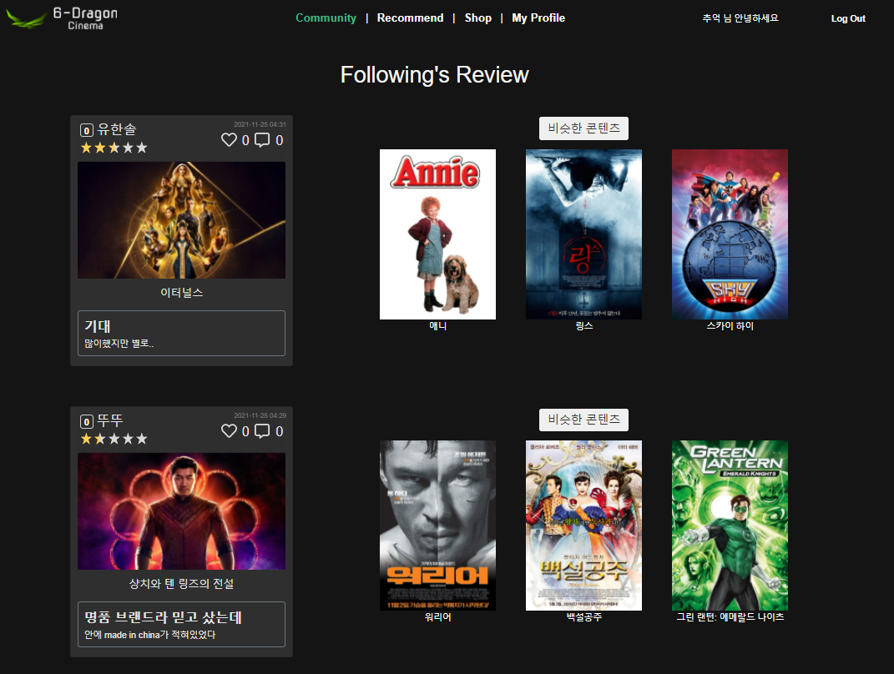
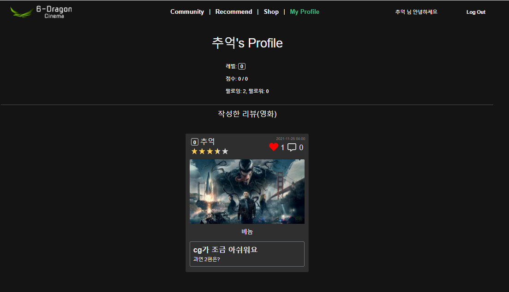
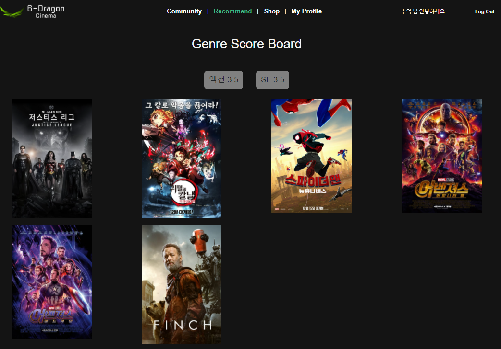
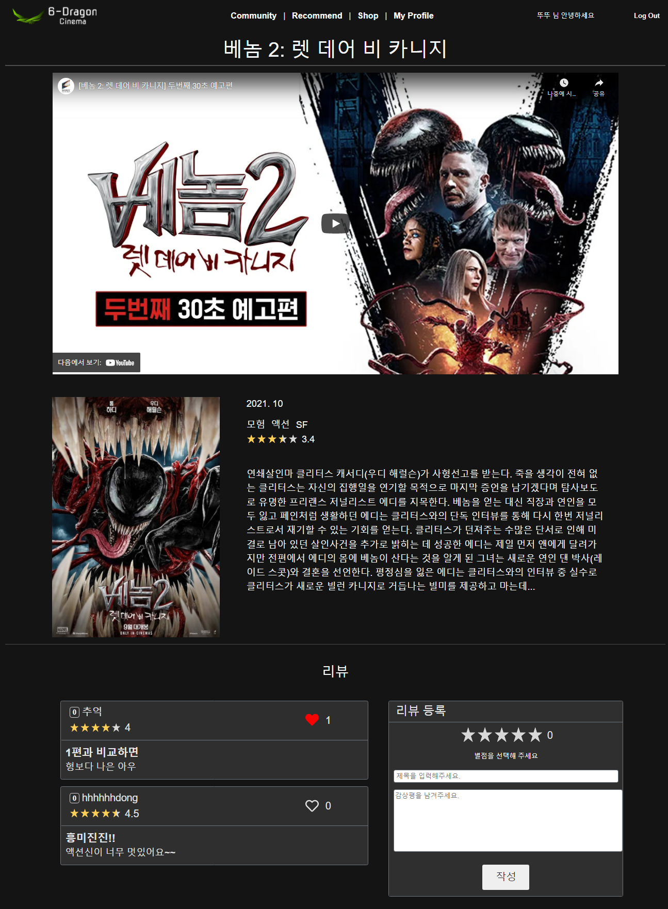
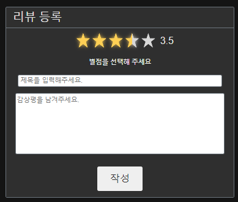
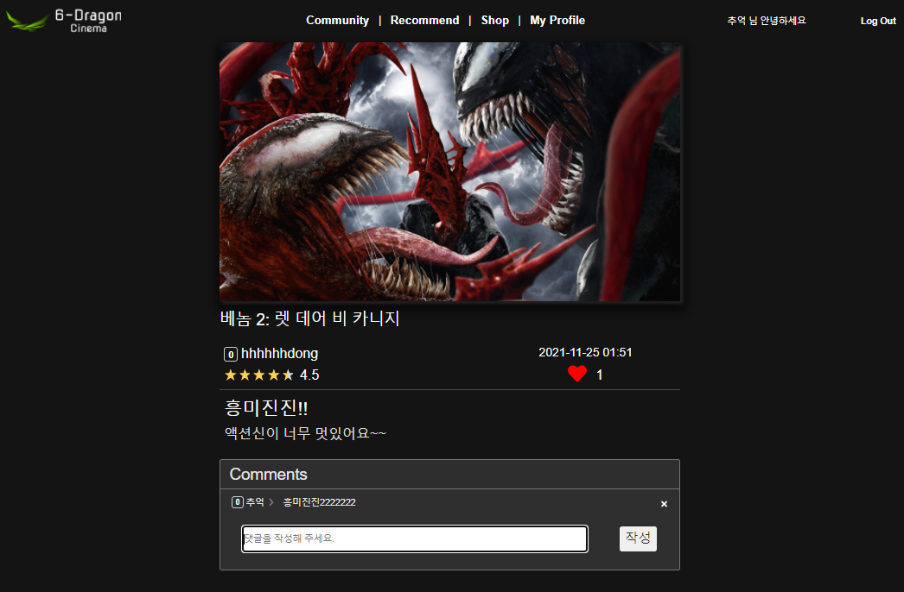
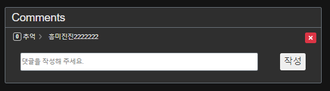
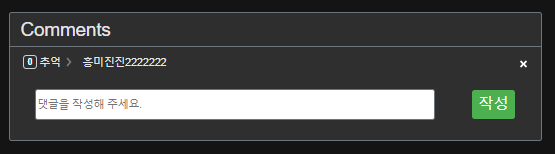

## 개발 개요

- 영화정보개발 추천 서비스 구성
- 커뮤니티 서비스 구성
- HTML, CSS, JavaScript, Vue.js, Django, REST API, DataBase등을 활용한 실제 서비스 설계


## 개발환경

### 언어 및 도구

- python
- django
- vue.js
- VSCode
- Chrome Browser

### 아키텍처

- **Django REST API 서버 & Vue.js**


## 서비스 개요

- TMDB API로 popular 영화 정보(100개)를 DB에 저장
- PC 전용 웹
- 영화 커뮤니티에 필요한 기능
  - 리뷰 작성, 수정, 삭제
    - 별점, 제목, 내용
  - 리뷰에 대한 댓글 작성, 삭제
  - 리뷰 좋아요 기능
  - 유저 팔로우 기능
- 추천
  - 영화하나에는 장르가 여러개(액션, 모험, 판타지 등)
  - 리뷰 작성시 평가한 별점이 영화 장르들의 점수를 올려주고
    장르의 점수가 높은 순으로
    장르의 영화를 추천함
- HTML, CSS 디자인


# 상세 내용

## front

### 패키지

- vuex

  - jwt 토큰으로 로그인 유무확인,
    로그인 유저정보를 vuex에 저장

- axios 비동기 요청

- vue-router

- bootstrap-vue

- 기타 패키지

  - lodash
  - vue-fontAwesome
  - swiper
  - vue-star-rating

### 컴포넌트 구조



- Home.vue

  - popularMovies.vue
    - movieCard.vue
  - topRatedMovies.vue
    - movieCard.vue

  - genreMovies.vue
    - genreMoviesItem.vue
      - movieCard.vue


- Community.vue (팔로우한 유저의 리뷰)
  - review/reviewCard.vue

- Recommend.vue (추천)
  - recommend/MovieCard.vue

- shop.vue

- profile.vue
  - review/reviewCard.vue


- movie.vue (영화 상세페이지)

  - movieDetail.vue (영화 정보)

  - review.vue (리뷰 목록, 작성)
    - reviewList.vue
      - reviewListItem.vue (여기서 reviewDetail.vue로 이동)
      - CreateReview.vue

- reviewDetail.vue (리뷰 상세페이지)


### 주요 기능 설명

#### 로그인

- 팔로우와 좋아요 기능 구현을 위해서는 로그인 유저정보가 필요

- 대부분의 기능이 로그인 유저만 접근가능하므로
  로그인 상태를 알고 있는 것도 필요

- 로그인을 하면 로그인 상태와 로그인한 유저의 정보를 vuex에 저장

  ```js
  export default new Vuex.Store({
    state: {
      isLogin: false,
      loginUser: null,
      
    },
    mutations: {
      GET_LOGIN_USER: function (state) {
        const token = localStorage.getItem('JWT')
        const config = {
            Authorization: `Bearer ${token}`
        }
        if (token) {
          axios({
            method: 'get',
            url: '/accounts/get/',
            headers: config
          })
          .then(res => {
            state.loginUser = res.data
          })
          .catch(err => {
            console.log(err)
          })
        }
      },
      DO_LOGIN: function (state) {
        state.isLogin = true
        // console.log(state.loginUser)
      },
      ...
    },
    actions: {
      ...
      doLogin: function ({commit}) {
        // console.log(user)
        commit('DO_LOGIN')
        commit('GET_LOGIN_USER')
      },
      ...
  ```

  - 기본값이 null이기 때문에 
    새로고침하면 로그인 상태와 로그인 유저정보를 다시 저장

    ```sj
      actions: {
        ...
    	refresh: function ({commit}) {
          commit('DO_LOGIN')
          commit('GET_LOGIN_USER')
        }
    ```

    - app.vue에서 refresh action 호출

      ```
        created: function () {
          if (localStorage.getItem('JWT')) {
            this.$store.dispatch('refresh')
          }
        }
      ```


#### Home

육룡이 시네마 메인 페이지



- popularMovies중 첫번째 영화를 상단에 크게 표시


다음 3가지 항목은 **swiper** 패키지를 이용하여
영화 포스터를 가로로 배치했다.

- popularMovies
- topRatedMovies
- genreMovies


#### Community (팔로우한 유저의 리뷰)



- 팔로우한 유저의 리뷰들을 최근 작성순으로 보여준다.
- 오른쪽에는 리뷰 영화와 관련된 영화를
  TMDB API로 받아와서 랜덤으로 3개를 표시
  -  포스터와 제목을 보여준다.


#### profile



- 유저의 레벨과 팔로우, 팔로워 숫자를 보여준다.
- 하단에는 작성한 리뷰 목록


#### Recommend (추천)



- 리뷰를 작성하면
  - 리뷰한 영화의 장르들은 별점만큼 점수가 올라가고
  - 장르 점수가 높은 순으로 장르의 영화들을 보여준다.


#### movie (영화 상세페이지)



- movieDetail.vue (영화 정보)

  - 상단에는 영화정보
    - TMDB API로 영화의 예고편 또는 티저 유튜브 영상 링크를 받고
      영화정보 상단에 유튜브 영상 출력
    - 영상밑에는
      영화 상세정보 표시

- review.vue (리뷰 목록, 작성)

  - 좋아요 기능
  - 별점

- vue-star-rating

  - 별점 표시를 위해 사용한 패키지

  - 리뷰나 영화정보에는 단순 표시

  - 리뷰 작성에는 별점을 선택할 수 있음

    

    

#### reviewDetail (리뷰 상세페이지)



- 상단에는 영화 가로 이미지
- 리뷰 상세 내용에는 시간표시, 좋아요 기능 구현
- 댓글
  - 삭제 버튼과 작성버튼은 마우스가 버튼위로 가면 색을 변경



​					

